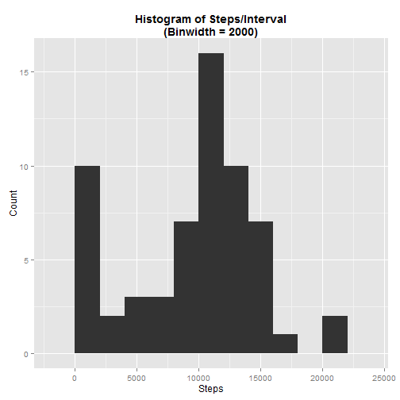
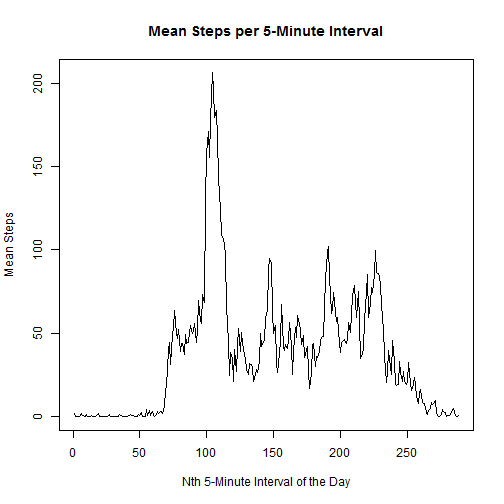
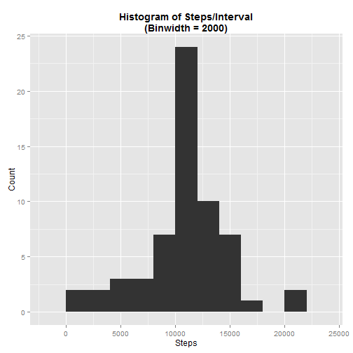
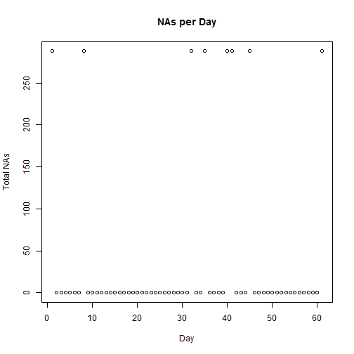
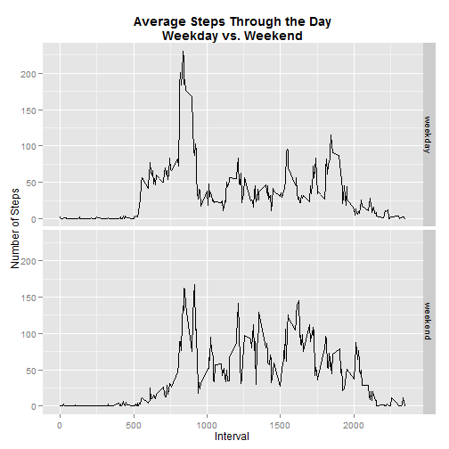

# Reproducible Research: Peer Assessment 1

This file explores data from a personal monitoring device tracking steps taken in 5-minute intervals over the 2-month span from October 1, 2012 to November 30, 2012. (available [here](https://d396qusza40orc.cloudfront.net/repdata%2Fdata%2Factivity.zip)).  The raw .csv datafile consists of 17568 observations of 3 variables:  

1. steps (an integer variable describing how many steps were recorded in each 5-minute interval)
2. date (a factor variable with the date, running from "2012-10-01" to "2012-11-30")
3. interval (an integer variable with values at increments of five from 0 to 2355 indicating the time of day of the 5-minute interval being recorded)

## Loading and preprocessing the data

This chunk of code produces no output, but it downloads the data from the course website, saves it to a data frame creatively named "data", and does a bit of pre-processing. Specifically:
- It coverts the column "interval" to a factor variable.
- It adds a column called "fancyDate" with the date as a POSIX object.
- It adds a factor variable called "day" recording which day of the experiment (1-61) on which a measurement was taken.


```r
# Load necessary packages
library(plyr)
library(ggplot2)

# Download and read in the data
fileURL <- "http://d396qusza40orc.cloudfront.net/repdata%2Fdata%2Factivity.zip"
temp <- tempfile()
download.file(fileURL, temp)
data <- read.csv(unzip(temp, "activity.csv"), header=T)
rm(fileURL)
rm(temp)

# Convert to appropriate classes and calculate useful date variables
data$interval <- factor(data$interval)
data$fancyDate <- strptime(data$date, format="%Y-%m-%d")
data$day <- factor(cut(data$fancyDate, breaks="day", labels=F))
```

## What is mean total number of steps taken per day?

To get a handle on this question, this code generates a histogram showing the relative frequency of each number of daily steps, then calculates the mean and median daily values.


```r
averageSteps <- aggregate(data$steps, by=list(data$day), function(x) sum(x, na.rm=T))
ggplot(averageSteps, aes(x)) + geom_histogram(binwidth=2000) + 
        labs(title="Histogram of Steps/Interval\n(Binwidth = 2000)", x = "Steps", y = "Count") +
        theme(plot.title = element_text(face="bold"))
```

 

```r
meanAverage <- round(mean(averageSteps$x, na.rm=T),1)
medianAverage <- median(averageSteps$x, na.rm=T)
```

By this method, we get an average daily mean of 9354.2 and an average daily median of 10395.  We can double-check that these look plausible based on the histogram (I think they do!).

## What is the average daily activity pattern?

This chunk of code uses the `aggregate` function to calculate the mean steps for each 5-minute interval, taking the average across all 61 days.  The results of that calculation are then plotted as a time series.


```r
intervalMeans <- aggregate(data$steps, list(data$interval), function(x) mean(x, na.rm=T))
names(intervalMeans) <- c("interval","intervalMean")
plot.ts(intervalMeans$intervalMean, xlab="Nth 5-Minute Interval of the Day", ylab="Mean Steps",
        main="Mean Steps per 5-Minute Interval")
```

 

```r
peakMean <- round(max(intervalMeans$intervalMean),1)
peakInterval <- which.max(intervalMeans$intervalMean)
```

The highest average (206.2) occurs at interval #104.

## Imputing missing values

First of all, we check to see if there are NA values in the dataset


```r
totalNAs <- sum(is.na(data))
```

Turns out there are `totalNAs` NA values in the dataset! The next step is to see which columns hold those NA values:


```r
columnNAs <- sapply(1:5, function(x) sum(is.na(data[,x])))
print(columnNAs)
```

```
## [1] 2304    0    0    0    0
```

So all of the NAs live in the first column--that is, "steps"--so there are `totalNAs` incomplete cases in the dataset.  The code below imputes the mean value for that interval to those rows where we have missing data and stores the new values in a column called "imputedData."


```r
data <- join(data, intervalMeans)
```

```
## Joining by: interval
```

```r
data$imputedSteps <- data$steps
data$imputedSteps[which(is.na(data$steps))] <- data$intervalMean[which(is.na(data$steps))]
```

The rest of the data analysis will take place in a copy of the original data frame called "newData" with the original "steps" column replaced by the "imputedSteps".  The code for generating and processing that copy is below (same steps as were taken with the original data frame above).


```r
## Create new dataset with imputed values
newData <- data.frame(data$imputedSteps, data$date, as.numeric(as.character(data$interval)))
names(newData) <- c("steps", "date", "interval")

## Setting up useful classes AGAIN, re-joining intervalMeans
newData$fancyDate <- strptime(data$date, format="%Y-%m-%d")
newData$day <- factor(cut(data$fancyDate, breaks="day", labels=F))
newData$interval <- factor(data$interval)
newData <- join(data, intervalMeans)
```

```
## Joining by: interval, intervalMean
```

The code below uses the same steps as above to create a histogram of the average steps per day over each of the 61 days, then calculates a mean and median for those averages; however, what were NAs have been replaced by imputed values.


```r
averageImpSteps <- aggregate(newData$imputedSteps, list(newData$day), function(x) sum(x, na.rm=T))
ggplot(averageImpSteps, aes(x)) + geom_histogram(binwidth=2000) +
        labs(title="Histogram of Steps/Interval\n(Binwidth = 2000)", x = "Steps", y = "Count") +
        theme(plot.title = element_text(face="bold"))
```

 

```r
meanImpAverage <- round(mean(averageImpSteps$x, na.rm=T),1)
medianImpAverage <- median(averageImpSteps$x, na.rm=T)
```

The mean average, including the imputed values, is 1.0766 &times; 10<sup>4</sup>, and the new median is 1.0766 &times; 10<sup>4</sup>.  The mean increased, while the median stayed the same.

### Sidebar: Why did the median stay the same, while the mean went up?

The distribution of the NAs holds the answer:


```r
dayNAs <- aggregate(newData$steps, list(newData$day), function(x) sum(is.na(x)))
plot(dayNAs$x, xlab="Day", ylab="Total NAs", main="NAs per Day")
```

 

As can be seen from the plot above, the NAs were concentrated in eight day-long chunks.  Hence, the original mean and median included all of those days as 0-step days.  Imputing each of those days to an average day (9354.2) doesn't change the median, since they're still below the "center value" but adds an additional 8 average means worth of steps (7.4834 &times; 10<sup>4</sup>) steps to the numerator that will get divided by 61 to calculate the new imputed mean.

## Are there differences in activity patterns between weekdays and weekends?

Finally, this code creates a factor variable labeling the day of the week of the date for each row, and a second factor variable identifying whether or not the date is a weekend.  The mean value for each interval is then calculated separately for weekdays and weekends, then plotted to produce a graphic comparing average daily activity on weekdays and weekends.


```r
newData$dayOfWeek <- weekdays(newData$fancyDate)
newData$isWeekend <- as.factor(newData$dayOfWeek %in% c("Saturday", "Sunday"))
levels(newData$isWeekend) <- c("weekday","weekend")
aggData <- aggregate(newData$imputedSteps, list(newData$interval, newData$isWeekend), mean)
names(aggData) <- c("interval", "isWeekend", "meanSteps")
p <- ggplot(aggData, aes(x=as.numeric(as.character(interval)), y=meanSteps)) + geom_line() + 
        facet_grid(isWeekend~.)
p <- p + xlab("Interval") + ylab ("Number of Steps") + 
        ggtitle("Average Steps Through the Day\nWeekday vs. Weekend") + 
        theme(plot.title = element_text(face="bold"))
p
```

 

At first glance, the graphic seems to show that folks seem to get up and go to bed a little later as well as be more active throughout the day on weekends.
